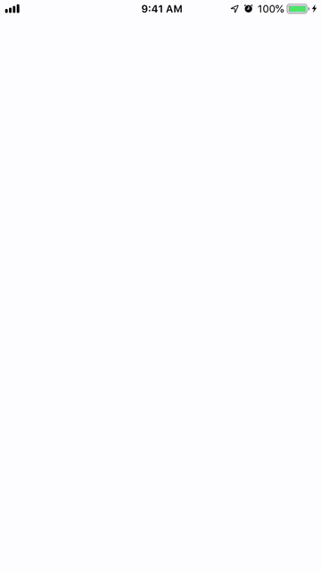

<!-- # Hello!
*Thanks for stopping by*. This repo serves as a kind of ever-changing portfolio of projects I'm currently excited about; please feel free to look around. -->
# Movieflix
[Movieflix](https://github.com/sclampet) a common iOS Developer take-home project I recently completed. The basic requirements for the app were that it display currently popular, newly released, and upcoming movies using data from [themoviedb.org](https://www.themoviedb.org/)'s REST api. Choice of design and UI elements were left up to me. I built this programmatically based on the Netflix app.

I'm extremely pleased with how the project came out. I'm particularly proud of the app's launch screen animation, overall design, and easily-extended architecture. Moviflix was built with Xcode and written entirely in Swift 5.  

# Overflow
[Overflow](https://github.com/sclampet) is a take-home project like app I recently completed. The basic requirements for the app were that it allow users to play a version of "Hangman" by selecting a game difficulty and then guessing individual letters or the entire word. Each game is followed by a stats popup to let users know whether they won and some basic performance metrics. Choice of design and UI elements were left up to me.

Overflow was built entirely in Swift, and the UI, which I built programmatically, is attractive and animates smoothly. Most importantly, the code is clean, easy to reason about, and maintains strong separation of concerns. I'm very proud of the main game animation and the custom keyboard I built using UIStackView. I implemented this using Airbnb's Lottie Animations.

# snuze
[snuze](https://github.com/sclampet)—the alarm clock designed to "positively" negatively reinforce your sleep habits—will be my first commercial iOS product. The app forces you to donate money to a good cause each time you decide to hit the snooze button. Snuze is being written entirely in Swift, integrates Stripe, and makes extensive use of Firebase/Firestore to manage user data. It's tenantive release date is the end of 2019. "You snuze you lose!"

Thanks!

# Contact Info:

- Email: scott@tao.team
- LinkedIn: [Scott Clampet](https://www.linkedin.com/in/sclampet/)
